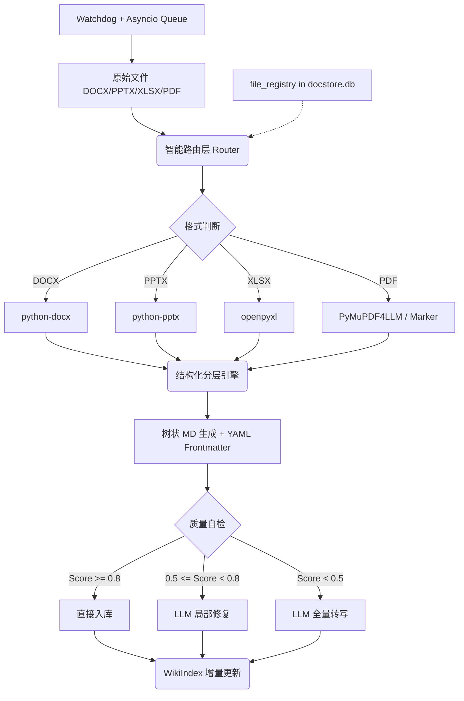

# 📄 Phase 4 Pre-Spec: Office+PDF 智能转换管道

> **版本**: v0.2 (Pre-Spec, Storage Consolidation)  
> **日期**: 2026-06-20  
> **状态**: ✅ 已合并 DocStore，不再新增独立 State DB

---

## 🎯 1. 目标与范围

**核心目标**：将企业文档（DOCX/PPTX/XLSX/PDF）自动转换为结构化 Markdown，并按语义层级生成树状文件集合，供 WikiIndex 进行增量索引。

**关键特性**：
- **智能路由**：根据文件格式选择最优解析器。
- **分层降级**：PDF 优先使用 PyMuPDF4LLM/Marker，兜底 OCR。
- **存储合并**：不再新增独立 State DB，直接在现有 DocStore (docstore.db) 中扩展 `file_registry` 表。
- **状态管理**：通过 `file_registry.sha256_hash` 对比实现精准增量更新。
- **并发处理**：Watchdog 事件不阻塞主线程，通过 Asyncio 队列异步处理。

---

## 🏗️ 2. 系统架构

### 2.1 存储全景（合并后）
```
WikiSearch/
├── whoosh_index/          ← BM25 倒排索引（Whoosh 目录）
├── turbovec_index/        ← 向量索引（TurboVec 文件）
└── docstore.db            ← SQLite，包含：
    ├── chunks             (chunk 内容 + hash)
    ├── chunk_mapping      (L1/L2 父子关系)
    └── file_registry      ← Phase 4 新增！(文件级状态管理)
```

**设计决策**：Phase 4 不另起炉灶加 `state.db`，直接在现有 DocStore 中扩展。`file_registry` + `chunks` 天然一对多关系，SQL JOIN 即可查询。

### 2.2 处理流水线


---

## 🛠️ 3. 核心模块设计

### 3.1 智能路由层 (Router)
- **职责**：识别文件类型，选择解析器。
- **策略**：优先检查扩展名 + Magic Bytes（防止伪装格式）。

### 3.2 解析器矩阵 (Parsers)
| 格式 | 主解析器 | 关键提取逻辑 |
|------|---------|------------|
| **DOCX** | `python-docx` | `para.style.name.startswith('Heading')` 识别标题；表格转 Markdown。
| **PPTX** | `python-pptx` | 逐 Slide 提取标题/正文/备注；按页生成独立 MD。
| **XLSX** | `openpyxl` | 每个 Sheet 视为一级分类，表格内容转 Markdown 格式。
| **PDF** | **PyMuPDF4LLM** / Marker | 保留布局、表格、公式；自动处理多栏/分页。

### 3.3 树状生成引擎 (Tree Generator)
- **规则**：
  - DOCX/PDF：按 `##` 标题切分为独立文件，长章节（>20页）再按 `_page_X.md` 拆分。
  - PPTX/XLSX：每张幻灯片/每个 Sheet 生成独立 MD。
- **元数据**：每个 MD 头部注入 YAML Frontmatter：
  ```yaml
  source: "原始文件名"
  chapter: "所属章节"
  page_range: "15-28"
  level: L2
  tags: [规划, 市场]
  updated: 2026-06-20T14:30:00
  ```

### 3.4 状态管理 (State Manager)
**不再新增独立 State DB，直接在现有 DocStore (`docstore.db`) 中扩展 `file_registry` 表。**

#### 📐 存储全景（合并后）
```
WikiSearch/
├── whoosh_index/          ← BM25 倒排索引（Whoosh 目录）
├── turbovec_index/        ← 向量索引（TurboVec 文件）
└── docstore.db            ← SQLite，包含：
    ├── chunks             (chunk 内容 + hash)
    ├── chunk_mapping      (L1/L2 父子关系)
    └── file_registry      ← Phase 4 新增！(文件级状态管理)
```

#### 📋 `file_registry` 表结构
```sql
CREATE TABLE IF NOT EXISTS file_registry (
    id INTEGER PRIMARY KEY AUTOINCREMENT,
    file_path TEXT UNIQUE NOT NULL,       -- 原始文件路径
    sha256_hash TEXT NOT NULL,            -- 文件内容指纹
    status TEXT DEFAULT 'pending',        -- pending/processing/done/error
    last_processed_time DATETIME,         -- 最后处理时间
    chunk_ids TEXT                        -- JSON数组，关联的chunk_id列表
);
```

#### 🔗 与现有 `chunks` 表的关系
```sql
-- DocStore 已有的 chunks 表（不动）
CREATE TABLE IF NOT EXISTS chunks (
    chunk_id INTEGER PRIMARY KEY AUTOINCREMENT,
    file_id INTEGER REFERENCES file_registry(id),  -- ← 外键关联
    content TEXT,
    hash TEXT,
    ...
);
```
**一对多关系**：一个 `file_registry` 记录对应多个 `chunks` 记录，SQL JOIN 即可查询。

---

## 🧠 4. 关键策略详解

### 4.1 章节识别（分层降级）
| 格式 | 优先级 | 策略 |
|------|--------|------|
| DOCX | P0 | `para.style.name` 匹配 Heading 样式。
| PDF | P0 | `pdf.outline` (书签树) → TOC正则解析 → PyMuPDF4LLM布局分析。
| PPTX | P1 | 标题幻灯片 + 过渡页检测（启发式）。

### 4.2 Chunking 策略（语义块优先）
- **阈值**：单 Chunk Token 数上限 **800**。
- **边界**：段落结束、二级以上标题出现时强制切分。
- **定位**：在 Markdown 中注入 HTML 注释标注原始页码：`<!-- source_page: 5 -->`。

### 4.3 LLM 介入协议（四阶段非对称拦截）
1. **Stage 0 (零成本规则)**：检查字符数异常、无标题标记、连续空行 >5、乱码率 >5%。触发则打低分标签。
2. **Stage 1 (小模型打分)**：使用本地 Qwen2-VL-7B 或启发式算法对前几页/表格页做结构确认。
3. **Stage 2 (局部修复)**：仅将“格式崩塌的 Chunk”及其上下文送给 LLM 修复（节省 Token）。
4. **Stage 3 (全量兜底)**：Score < 0.5 时，LLM 重新转写整段内容。

---

## ⚡ 5. 增量更新逻辑
**合并到 DocStore 后，变更检测变得极其简单：**
```python
def on_file_change(self, file_path):
    new_hash = sha256(file_path)
    
    # 查 file_registry（一个 SQL 查询搞定）
    row = self.db.execute(
        "SELECT sha256_hash FROM file_registry WHERE file_path = ?",
        (file_path,)
    ).fetchone()
    
    if not row or row[0] != new_hash:
        # Hash 变了或新文件 → 触发转换
        self.convert_and_index(file_path)
        
        # 更新 file_registry（INSERT OR REPLACE）
        self.db.execute("""
            INSERT OR REPLACE INTO file_registry 
            (file_path, sha256_hash, status, last_processed_time)
            VALUES (?, ?, 'done', datetime('now'))
        """, (file_path, new_hash))
    else:
        # 没变，跳过
        pass
```

## ⚡ 6. 并发与 Watchdog
- **防抖机制 (Debounce)**：Watchdog 回调中延迟 **2-3秒** 再触发处理，等待文件写入句柄释放、Hash 稳定。
- **异步队列**：事件不直接同步处理，而是推入 `asyncio.Queue`，由后台 Worker 消费。
- **冲突处理**：用户编辑 MD 后标记为 `User-Modified`。若原始文件更新，生成 `.md.next` 临时文件并通知用户 Diff。

---

## 📅 7. MVP 路线图（2周冲刺）

### 第 1 周：骨干管道
- [ ] **P0**: 实现 DOCX 解析（标题+表格）与 PDF 书签识别。
- [ ] **P0**: 核心树状生成算法 + YAML Frontmatter 注入。
- [ ] **P1**: `file_registry` 表设计 + 基础单向增量逻辑（文件 Hash 变更触发全量重转）。

### 第 2 周：健壮性与高级格式
- [ ] **P1**: Watchdog + Asyncio Queue 实现真正的后台监听与防抖。
- [ ] **P2**: PPTX/XLSX 基础转换（按页/Sheet拆分）。
- [ ] **P2**: PDF 无书签降级方案（PyMuPDF4LLM 一把梭）。
- [ ] **Backlog**: LLM 质量评分、OCR 回退、Diff 冲突处理。

---

*Pre-Spec 完成时间：2026-06-20 | 评审人：小千 & Gemini*
